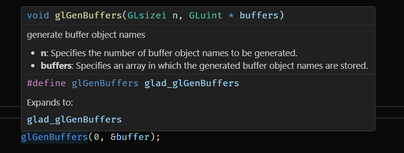

# gl Macro Hints

A small extension to display the definitions of OpenGL functions and their parameters as a small window when hovering over such a macro.

Supports multiple OpenGL standards: `"es1.1", "es2.0", "es3", "es3.0", "es3.1", "gl2.1", "gl4"`, which can be configured in your VSCode `settings.json`
file via the `glMacroHints.glVersion` option.

The documentation was provided by the [docs.gl project on GitHub](https://github.com/BSVino/docs.gl). It's not feasable to make every user of this extension re-download and parse the entire documentation, so instead, I just ship a simple json file that includes the necessary strings used for the inline documentation.
